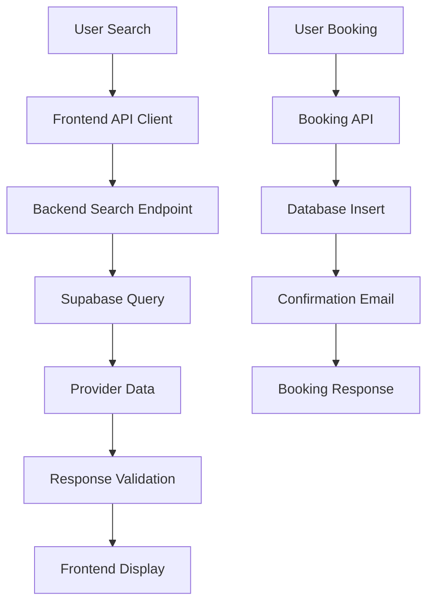

# Mario Health API Integration Guide

**Backend Engineer Handoff Documentation**  
*For AC - Complete integration guide with architecture, endpoints, and implementation details*

---

## 📋 Table of Contents

1. [Architecture Overview](#architecture-overview)
2. [API Endpoints](#api-endpoints)
3. [TypeScript Types & Schemas](#typescript-types--schemas)
4. [Sample Requests](#sample-requests)
5. [Mock Data Examples](#mock-data-examples)
6. [Environment Setup](#environment-setup)
7. [Troubleshooting](#troubleshooting)
8. [Current Implementation Status](#current-implementation-status)

---

## 🏗️ Architecture Overview

### System Architecture

```
┌─────────────────┐    ┌─────────────────┐    ┌─────────────────┐
│   Frontend      │    │   Backend API   │    │   Database      │
│   (Next.js)     │◄──►│   (FastAPI)     │◄──►│   (Supabase)    │
│                 │    │                 │    │                 │
│ • Search UI     │    │ • Search        │    │ • Procedures    │
│ • Provider Cards│    │ • Providers     │    │ • Categories    │
│ • Booking Flow  │    │ • Bookings      │    │ • Providers     │
│ • Mock Data     │    │ • Insurance     │    │ • Reviews       │
└─────────────────┘    └─────────────────┘    └─────────────────┘
```

### Data Flow



### Current Implementation Status

| Component | Status | Notes |
|-----------|--------|-------|
| **Backend API** | 🟡 Partial | Basic search + procedure categories |
| **Provider Search** | 🔴 Missing | Frontend expects full provider data |
| **Booking System** | 🔴 Missing | Complete booking flow needed |
| **Insurance Verification** | 🔴 Missing | Coverage checking system |
| **Time Slots** | 🔴 Missing | Availability management |
| **Reviews System** | 🔴 Missing | Provider reviews & ratings |

---

## 🔌 API Endpoints

### Base URLs
- **Development**: `http://localhost:3000/api`
- **Staging**: `https://staging-api.mariohealth.com`
- **Production**: `https://api.mariohealth.com`

### Authentication
All endpoints require API key authentication via header:
```
X-API-Key: your-api-key-here
```

---

### 1. Search Providers ⚠️ **MISSING - HIGH PRIORITY**

**Endpoint**: `GET /api/search`

**Purpose**: Search for healthcare providers based on procedure, location, and filters.

**Query Parameters**:
```typescript
interface SearchParams {
  procedure: string;           // Required: "MRI scan", "Annual physical"
  location?: string;           // Optional: "New York, NY"
  insuranceProvider?: string; // Optional: "Aetna", "Blue Cross"
  maxDistance?: number;       // Optional: 10 (miles)
  minPrice?: number;          // Optional: 100
  maxPrice?: number;          // Optional: 1000
  minRating?: number;         // Optional: 4.0 (1-5 scale)
  types?: string;             // Optional: "hospital,clinic" (comma-separated)
}
```

**Expected Response**:
```json
{
  "providers": [
    {
      "id": "provider-123",
      "name": "NewYork-Presbyterian Hospital",
      "specialty": "Imaging",
      "rating": 4.8,
      "reviewCount": 1247,
      "address": {
        "street": "525 East 68th Street",
        "city": "New York",
        "state": "NY",
        "zip": "10065"
      },
      "distance": "2.3 miles",
      "priceRange": { "min": 400, "max": 500 },
      "acceptedInsurance": ["UnitedHealthcare", "Aetna", "Cigna"],
      "phone": "(212) 746-5454",
      "website": "https://www.nyp.org",
      "images": ["https://example.com/image1.jpg"],
      "availability": "Next available: Tomorrow 9:00 AM",
      "badges": ["Same Day Available", "Insurance Partner"],
      "type": "hospital",
      "neighborhood": "Upper East Side",
      "acceptsInsurance": true,
      "price": 450,
      "originalPrice": 750,
      "negotiatedRate": 450,
      "standardRate": 750,
      "savingsPercent": 40,
      "savings": 300,
      "availableTimeSlots": [
        {
          "date": "2024-01-15",
          "time": "09:00",
          "available": true
        }
      ]
    }
  ],
  "totalCount": 42,
  "filters": {
    "priceRange": [50, 2000],
    "locations": ["New York, NY", "Brooklyn, NY"],
    "insuranceProviders": ["Aetna", "Blue Cross", "Cigna"],
    "specialties": ["Imaging", "Primary Care", "Cardiology"]
  }
}
```

---

### 2. Get Provider Details ⚠️ **MISSING - HIGH PRIORITY**

**Endpoint**: `GET /api/providers/:id`

**Purpose**: Get detailed information about a specific provider including reviews, time slots, and extended details.

**Response**: Same as provider object in search results, plus:
```json
{
  "about": "NewYork-Presbyterian is one of the nation's most comprehensive academic health care delivery systems...",
  "specialties": ["Cardiology", "Orthopedics", "Neurology"],
  "languages": ["English", "Spanish", "Chinese"],
  "reviews": [
    {
      "id": "rev1",
      "author": "Sarah M.",
      "rating": 5,
      "comment": "Excellent care and very professional staff.",
      "date": "2024-01-15"
    }
  ],
  "parkingAvailable": true,
  "wheelchairAccessible": true,
  "requiresReferral": false,
  "newPatientAccepted": true
}
```

---

### 3. Create Booking ⚠️ **MISSING - HIGH PRIORITY**

**Endpoint**: `POST /api/bookings`

**Purpose**: Create a new appointment booking.

**Request Body**:
```json
{
  "providerId": "provider-123",
  "firstName": "John",
  "lastName": "Doe",
  "email": "john.doe@example.com",
  "phone": "(555) 123-4567",
  "dateOfBirth": "1990-01-01",
  "memberId": "AET123456789",
  "preferredDate": "2024-01-15",
  "insuranceProvider": "Aetna",
  "reasonForVisit": "Annual checkup",
  "notes": "Patient prefers morning appointments"
}
```

**Response**:
```json
{
  "bookingId": "booking-456",
  "confirmationNumber": "MH-2024-001234",
  "status": "confirmed",
  "appointmentDate": "2024-01-15",
  "appointmentTime": "09:00",
  "provider": {
    "id": "provider-123",
    "name": "Dr. John Smith",
    "phone": "(555) 123-4567",
    "address": {
      "street": "123 Main St",
      "city": "New York",
      "state": "NY",
      "zip": "10001"
    }
  },
  "patient": {
    "name": "John Doe",
    "email": "john.doe@example.com",
    "phone": "(555) 123-4567"
  }
}
```

---

### 4. Get Available Time Slots ⚠️ **MISSING - MEDIUM PRIORITY**

**Endpoint**: `GET /api/providers/:providerId/time-slots`

**Query Parameters**:
- `date` (optional): Specific date in YYYY-MM-DD format

**Response**:
```json
[
  {
    "date": "2024-01-15",
    "time": "09:00",
    "available": true
  },
  {
    "date": "2024-01-15",
    "time": "10:00",
    "available": false
  }
]
```

---

### 5. Verify Insurance ⚠️ **MISSING - MEDIUM PRIORITY**

**Endpoint**: `POST /api/insurance/verify`

**Request Body**:
```json
{
  "memberId": "AET123456789",
  "providerId": "provider-123"
}
```

**Response**:
```json
{
  "verified": true,
  "coverage": {
    "copay": 25,
    "deductible": 500,
    "coinsurance": 20
  }
}
```

---

### 6. Get Procedures ✅ **IMPLEMENTED**

**Endpoint**: `GET /api/procedures`

**Query Parameters**:
- `q` (optional): Search query for procedures

**Response**:
```json
{
  "procedures": [
    {
      "id": "procedure-1",
      "name": "MRI Scan (Brain)",
      "category": "Imaging",
      "description": "Magnetic resonance imaging of the brain",
      "averagePrice": 850
    }
  ]
}
```

---

### 7. Get Insurance Providers ⚠️ **MISSING - LOW PRIORITY**

**Endpoint**: `GET /api/insurance/providers`

**Response**:
```json
{
  "providers": [
    {
      "id": "aetna",
      "name": "Aetna",
      "logo": "https://example.com/aetna-logo.png"
    }
  ]
}
```

---

## 📝 TypeScript Types & Schemas

### Core Types (from `/frontend/src/types/api.ts`)

```typescript
// Base API response wrapper
interface ApiResponse<T = any> {
  data?: T;
  error?: ApiError;
  message?: string;
  success: boolean;
}

// Standard API error structure
interface ApiError {
  message: string;
  code: string;
  details?: Record<string, any>;
  statusCode?: number;
}

// Provider information
interface Provider {
  id: string;
  name: string;
  specialty: string;
  rating: number;
  reviewCount: number;
  address: ProviderAddress;
  distance: string;
  priceRange: { min: number; max: number };
  acceptedInsurance: string[];
  phone?: string;
  website?: string;
  images?: string[];
  reviews?: Review[];
  availability?: string;
  badges?: string[];
  type?: ProviderType;
  neighborhood?: string;
  acceptsInsurance?: boolean;
  price: number;
  originalPrice?: number;
  negotiatedRate?: number;
  standardRate?: number;
  savingsPercent?: number;
  savings?: number;
  availableTimeSlots?: TimeSlot[];
  
  // Extended fields for provider detail pages
  about?: string;
  specialties?: string[];
  languages?: string[];
  parkingAvailable?: boolean;
  wheelchairAccessible?: boolean;
  requiresReferral?: boolean;
  newPatientAccepted?: boolean;
}

// Provider types
type ProviderType = 'physician' | 'specialist' | 'clinic' | 'hospital' | 'imaging_center' | 'lab';

// Address can be string or structured object
type ProviderAddress = string | {
  street: string;
  city: string;
  state: string;
  zip: string;
};

// Review structure
interface Review {
  id: string;
  author: string;
  rating: number;
  comment: string;
  date: string;
}

// Time slot for booking
interface TimeSlot {
  date: string;
  time: string;
  available: boolean;
}

// Booking data
interface BookingData {
  providerId: string;
  firstName: string;
  lastName: string;
  email: string;
  phone: string;
  dateOfBirth: string;
  memberId: string;
  preferredDate: string;
  insuranceProvider?: string;
  reasonForVisit?: string;
  notes?: string;
}

// Booking response
interface BookingResponse {
  bookingId: string;
  confirmationNumber: string;
  status: BookingStatus;
  appointmentDate: string;
  appointmentTime: string;
  provider: Pick<Provider, 'id' | 'name' | 'phone' | 'address'>;
  patient: {
    name: string;
    email: string;
    phone: string;
  };
}

type BookingStatus = 'confirmed' | 'pending' | 'cancelled';
```

### Validation Schemas

The frontend uses Zod schemas for validation. Backend should implement similar validation:

```typescript
// Example validation schemas
export const ProviderSchema = z.object({
  id: z.string(),
  name: z.string(),
  specialty: z.string(),
  rating: z.number().min(0).max(5),
  reviewCount: z.number().min(0),
  address: z.union([
    z.string(),
    z.object({
      street: z.string(),
      city: z.string(),
      state: z.string(),
      zip: z.string(),
    })
  ]),
  price: z.number().min(0),
  // ... other fields
});
```

---

## 🧪 Sample Requests

### 1. Search for MRI Providers

```bash
curl -X GET "http://localhost:3000/api/search?procedure=MRI%20scan&location=New%20York%2C%20NY&maxDistance=10&minRating=4.0" \
  -H "X-API-Key: your-api-key" \
  -H "Content-Type: application/json"
```

### 2. Get Provider Details

```bash
curl -X GET "http://localhost:3000/api/providers/provider-123" \
  -H "X-API-Key: your-api-key" \
  -H "Content-Type: application/json"
```

### 3. Create Booking

```bash
curl -X POST "http://localhost:3000/api/bookings" \
  -H "X-API-Key: your-api-key" \
  -H "Content-Type: application/json" \
  -d '{
    "providerId": "provider-123",
    "firstName": "John",
    "lastName": "Doe",
    "email": "john.doe@example.com",
    "phone": "(555) 123-4567",
    "dateOfBirth": "1990-01-01",
    "memberId": "AET123456789",
    "preferredDate": "2024-01-15",
    "insuranceProvider": "Aetna",
    "reasonForVisit": "Annual checkup"
  }'
```

### 4. Get Time Slots

```bash
curl -X GET "http://localhost:3000/api/providers/provider-123/time-slots?date=2024-01-15" \
  -H "X-API-Key: your-api-key" \
  -H "Content-Type: application/json"
```

### 5. Verify Insurance

```bash
curl -X POST "http://localhost:3000/api/insurance/verify" \
  -H "X-API-Key: your-api-key" \
  -H "Content-Type: application/json" \
  -d '{
    "memberId": "AET123456789",
    "providerId": "provider-123"
  }'
```

---

## 📊 Mock Data Examples

### Current Mock Provider Data

The frontend currently uses mock data from `/frontend/src/lib/mockData.ts`. Here are key examples:

#### Sample Provider (NewYork-Presbyterian Hospital)
```json
{
  "id": "1",
  "name": "NewYork-Presbyterian Hospital",
  "type": "hospital",
  "rating": 4.8,
  "reviewCount": 1247,
  "price": 450,
  "originalPrice": 750,
  "distance": "2.3 miles",
  "address": {
    "street": "525 East 68th Street",
    "city": "New York",
    "state": "NY",
    "zip": "10065"
  },
  "neighborhood": "Upper East Side",
  "availability": "Next available: Tomorrow 9:00 AM",
  "acceptsInsurance": true,
  "insurancePartners": ["UnitedHealthcare", "Aetna", "Cigna", "Blue Cross"],
  "phone": "(212) 746-5454",
  "website": "https://www.nyp.org",
  "about": "NewYork-Presbyterian is one of the nation's most comprehensive academic health care delivery systems...",
  "specialties": ["Cardiology", "Orthopedics", "Neurology", "Oncology", "Primary Care"],
  "languages": ["English", "Spanish", "Chinese", "Russian"],
  "parkingAvailable": true,
  "wheelchairAccessible": true,
  "requiresReferral": false,
  "newPatientAccepted": true,
  "negotiatedRate": 450,
  "standardRate": 750,
  "savings": 300,
  "savingsPercent": 40
}
```

#### Sample Review
```json
{
  "id": "rev1",
  "patientName": "Sarah M.",
  "rating": 5,
  "date": "2025-10-15",
  "comment": "Excellent care and very professional staff. The facility is modern and clean. Wait time was minimal.",
  "procedure": "Routine Physical Exam"
}
```

#### Sample Time Slot
```json
{
  "id": "slot-1-0",
  "date": "2025-10-26",
  "time": "09:00 AM",
  "available": true
}
```

### UI Screenshots Description

#### 1. Home Page (`/`)
- **Hero Search Bar**: Large search input with placeholder "Search procedures, doctors, locations..."
- **Savings Card**: Shows "$1,247 saved this year with Mario" with green background
- **Procedure Cards**: Two cards showing "MRI Scan (Brain)" ($850 vs $1,400) and "Annual Physical Exam" ($95 vs $220)
- **Quick Action Chips**: Three horizontal scrollable buttons: "✨ I have a health concern", "📅 Book a visit", "💊 Rx renewal"
- **Common Actions List**: Four items with icons: "🩺 Browse Procedures", "👨‍⚕️ Find Doctors", "💊 Medications", "📞 MarioCare"

#### 2. Search Results Page (`/search`)
- **Search Header**: Shows search query, location, and result count
- **Filter Sidebar** (Desktop): Price range slider, provider type checkboxes, minimum rating
- **Mobile Filter Button**: "Filters" button with slider icon
- **Sort Options**: Dropdown with "Lowest Price", "Highest Rated", "Nearest"
- **Provider Cards**: Each showing:
  - Provider name and type badge
  - Rating stars and review count
  - Price with original price crossed out and savings percentage
  - Distance and availability
  - "Book Now" button
  - Insurance acceptance indicator

#### 3. Provider Detail Page (`/provider/[id]`)
- **Provider Header**: Large image, name, rating, price, and "Book Now" button
- **Provider Info**: About section, specialties, languages, contact info
- **Reviews Section**: List of patient reviews with ratings and comments
- **Time Slot Picker**: Calendar view with available appointment times
- **Booking Form**: Patient information form with validation

---

## ⚙️ Environment Setup

### Backend Environment Variables

Create `.env` file in `/backend/mario-health-api/`:

```bash
# Database
SUPABASE_URL=your-supabase-url
SUPABASE_KEY=your-supabase-key
SUPABASE_SERVICE_ROLE_KEY=your-service-role-key

# API Configuration
API_KEY=your-api-key-for-authentication
ENVIRONMENT=development  # development, staging, production

# CORS Settings
ALLOWED_ORIGINS=http://localhost:3000,https://mariohealth.com

# Logging
LOG_LEVEL=INFO
```

### Frontend Environment Variables

Create `.env.local` file in `/frontend/`:

```bash
# API Configuration
NEXT_PUBLIC_API_URL=http://localhost:3000/api
NEXT_PUBLIC_API_KEY=your-api-key

# Environment
NODE_ENV=development
```

### Database Schema

The backend should implement these main tables:

```sql
-- Providers table
CREATE TABLE providers (
  id UUID PRIMARY KEY DEFAULT gen_random_uuid(),
  name VARCHAR(255) NOT NULL,
  specialty VARCHAR(100),
  type VARCHAR(50) NOT NULL, -- hospital, clinic, imaging_center, etc.
  rating DECIMAL(2,1) DEFAULT 0,
  review_count INTEGER DEFAULT 0,
  address JSONB, -- Can store as string or structured object
  neighborhood VARCHAR(100),
  phone VARCHAR(20),
  website VARCHAR(255),
  accepts_insurance BOOLEAN DEFAULT true,
  created_at TIMESTAMP DEFAULT NOW(),
  updated_at TIMESTAMP DEFAULT NOW()
);

-- Procedures table
CREATE TABLE procedures (
  id UUID PRIMARY KEY DEFAULT gen_random_uuid(),
  name VARCHAR(255) NOT NULL,
  category VARCHAR(100),
  description TEXT,
  average_price DECIMAL(10,2),
  created_at TIMESTAMP DEFAULT NOW()
);

-- Provider procedures (many-to-many)
CREATE TABLE provider_procedures (
  provider_id UUID REFERENCES providers(id),
  procedure_id UUID REFERENCES procedures(id),
  price DECIMAL(10,2),
  original_price DECIMAL(10,2),
  negotiated_rate DECIMAL(10,2),
  PRIMARY KEY (provider_id, procedure_id)
);

-- Reviews table
CREATE TABLE reviews (
  id UUID PRIMARY KEY DEFAULT gen_random_uuid(),
  provider_id UUID REFERENCES providers(id),
  patient_name VARCHAR(100),
  rating INTEGER CHECK (rating >= 1 AND rating <= 5),
  comment TEXT,
  procedure_name VARCHAR(255),
  date DATE,
  created_at TIMESTAMP DEFAULT NOW()
);

-- Bookings table
CREATE TABLE bookings (
  id UUID PRIMARY KEY DEFAULT gen_random_uuid(),
  provider_id UUID REFERENCES providers(id),
  first_name VARCHAR(100) NOT NULL,
  last_name VARCHAR(100) NOT NULL,
  email VARCHAR(255) NOT NULL,
  phone VARCHAR(20) NOT NULL,
  date_of_birth DATE NOT NULL,
  member_id VARCHAR(100),
  preferred_date DATE,
  appointment_time TIME,
  insurance_provider VARCHAR(100),
  reason_for_visit TEXT,
  notes TEXT,
  status VARCHAR(20) DEFAULT 'pending',
  confirmation_number VARCHAR(50),
  created_at TIMESTAMP DEFAULT NOW()
);

-- Time slots table
CREATE TABLE time_slots (
  id UUID PRIMARY KEY DEFAULT gen_random_uuid(),
  provider_id UUID REFERENCES providers(id),
  date DATE NOT NULL,
  time TIME NOT NULL,
  available BOOLEAN DEFAULT true,
  booking_id UUID REFERENCES bookings(id),
  created_at TIMESTAMP DEFAULT NOW()
);
```

---

## 🔧 Troubleshooting

### Common Issues

#### 1. CORS Errors ⚠️ **CRITICAL - BACKEND CONFIGURATION REQUIRED**
**Problem**: Frontend can't connect to backend API. Error message: "CORS Error: The backend needs to allow requests from your domain."

**Root Cause**: The backend API must explicitly allow requests from the frontend domain. This is a security feature of browsers.

**Solution for AC (Backend Team)**: 
Configure CORS middleware in FastAPI to allow requests from frontend domains:

```python
from fastapi.middleware.cors import CORSMiddleware

app.add_middleware(
    CORSMiddleware,
    allow_origins=[
        "http://localhost:3000",
        "http://localhost:3001",
        "https://mariohealth.com",
        "https://www.mariohealth.com",
        "https://mario-health-frontend.vercel.app",  # Add your Vercel domain
        # Add any other production/staging domains
    ],
    allow_credentials=True,
    allow_methods=["GET", "POST", "PUT", "DELETE", "OPTIONS"],
    allow_headers=["*"],
    expose_headers=["*"],
)
```

**Important Notes**:
- The `allow_origins` list must include ALL domains that will make requests to the API
- For development, `http://localhost:3000` is required
- For production, add your Vercel/deployment domain
- Wildcard origins (`["*"]`) should NOT be used in production
- If using authentication (Bearer tokens), `allow_credentials=True` is required

**Frontend Error Handling**: 
The frontend now detects CORS errors and displays: "CORS Error: The backend needs to allow requests from your domain. Contact the backend team."

**Testing**: 
1. Start frontend: `npm run dev` (runs on http://localhost:3000)
2. Attempt API call from browser
3. Check browser console for CORS errors
4. Verify backend logs show the OPTIONS preflight request

**Status**: ⚠️ AC needs to configure CORS settings in the backend before frontend can successfully connect.

#### 2. Network Errors
**Problem**: "Network error. Check your connection."

**Common Causes**:
- Backend API is not running
- Incorrect API URL in `NEXT_PUBLIC_API_URL`
- Network connectivity issues
- Firewall blocking requests

**Solution**:
1. Verify backend is running: `curl http://localhost:8000/health`
2. Check `NEXT_PUBLIC_API_URL` in `.env.local`
3. Test API directly with `curl` or Postman
4. Check browser Network tab for failed requests

#### 3. Authentication Errors (401/403)
**Problem**: "Authentication failed. Please refresh."

**Common Causes**:
- Missing or invalid API key
- Token expired
- Insufficient permissions

**Solution**:
1. Verify API key is set in environment variables
2. Check token expiration (GCP identity tokens expire after 1 hour)
3. Refresh the page to get a new token
4. For GCP Cloud Run, ensure service account has proper IAM permissions

#### 4. Server Errors (500/502/503)
**Problem**: "Server error. Please try again later."

**Common Causes**:
- Backend application crashed
- Database connection issues
- Internal server errors

**Solution**:
1. Check backend logs for error details
2. Verify database connectivity
3. Check backend health endpoint
4. Retry the request after a few seconds

#### 5. API Key Authentication
**Problem**: 401 Unauthorized errors
**Solution**: Ensure API key is passed in headers:
```bash
curl -H "X-API-Key: your-api-key" http://localhost:3000/api/search
```

#### 6. Data Type Mismatches
**Problem**: Frontend expects different data structure than backend provides
**Solution**: Match the exact TypeScript interfaces in `/frontend/src/types/api.ts`

#### 4. Missing Required Fields
**Problem**: Frontend crashes due to missing provider fields
**Solution**: Ensure all required fields are present:
- `id`, `name`, `rating`, `reviewCount`, `price`, `address`, `distance`
- Optional but recommended: `phone`, `website`, `images`, `availability`

#### 7. Date/Time Format Issues
**Problem**: Date parsing errors in frontend
**Solution**: Use consistent formats:
- Dates: `YYYY-MM-DD` (ISO format)
- Times: `HH:MM` (24-hour format)

---

## 🧪 Testing Checklist

Before deploying to production, verify:

### ✅ Frontend Testing
- [ ] All API endpoints respond correctly
- [ ] No CORS errors in browser console
- [ ] Error messages display correctly (network, auth, server errors)
- [ ] Loading states work properly
- [ ] Retry functionality works
- [ ] Authentication tokens refresh automatically

### ✅ Backend Testing
- [ ] CORS configured for all frontend domains
- [ ] Health check endpoint responds
- [ ] Authentication middleware works
- [ ] Error responses follow expected format
- [ ] Rate limiting configured (if applicable)

### ✅ Integration Testing
- [ ] Frontend can connect to backend API
- [ ] API responses match expected TypeScript types
- [ ] Error handling works end-to-end
- [ ] Authentication flow works correctly
- [ ] Search functionality returns expected results

### ✅ Error Scenarios
- [ ] Network disconnection handled gracefully
- [ ] 401 errors trigger token refresh
- [ ] 500 errors show user-friendly message
- [ ] CORS errors display helpful message
- [ ] Timeout errors handled correctly

### Error Response Format

All endpoints should return errors in this format:
```json
{
  "error": {
    "message": "Provider not found",
    "code": "PROVIDER_NOT_FOUND",
    "details": {
      "providerId": "invalid-id"
    },
    "statusCode": 404
  }
}
```

### Rate Limiting

Implement rate limiting:
- Search endpoints: 100 requests/minute per IP
- Booking endpoints: 10 requests/minute per IP
- Other endpoints: 60 requests/minute per IP

---

## 📈 Current Implementation Status

### ✅ Completed
- [x] Basic FastAPI setup with CORS
- [x] Procedure search endpoint (`/search?q=...`)
- [x] Procedure categories endpoint (`/procedure-categories`)
- [x] Supabase integration
- [x] API key authentication

### 🟡 In Progress
- [ ] Provider search endpoint (basic structure exists)
- [ ] Database schema design

### 🔴 Missing - High Priority
- [ ] **Provider search with full data structure**
- [ ] **Provider detail endpoint**
- [ ] **Booking creation system**
- [ ] **Time slot management**
- [ ] **Review system**
- [ ] **Insurance verification**

### 🔴 Missing - Medium Priority
- [ ] **Insurance providers list**
- [ ] **Booking management (get, cancel)**
- [ ] **Advanced search filters**
- [ ] **Pagination for large result sets**

### 🔴 Missing - Low Priority
- [ ] **Analytics endpoints**
- [ ] **Admin dashboard APIs**
- [ ] **Email notification system**
- [ ] **Payment processing integration**

---

## 🎯 Next Steps for AC

1. **Immediate (This Week)**:
   - Implement provider search endpoint with full data structure
   - Create provider detail endpoint
   - Set up proper database schema

2. **Short Term (Next 2 Weeks)**:
   - Implement booking system
   - Add time slot management
   - Create review system

3. **Medium Term (Next Month)**:
   - Add insurance verification
   - Implement advanced search filters
   - Add pagination and performance optimization

---

## 📞 Contact & Support

- **Frontend Team**: Arman (Lead Developer)
- **Backend Team**: AC (Lead Developer)
- **Project Manager**: DS
- **Documentation**: This guide + `/docs/API_CONTRACT.md`

**Questions?** Create an issue in the project repository or reach out via Slack.

---

*Last updated: January 2024*
*Version: 1.0*
