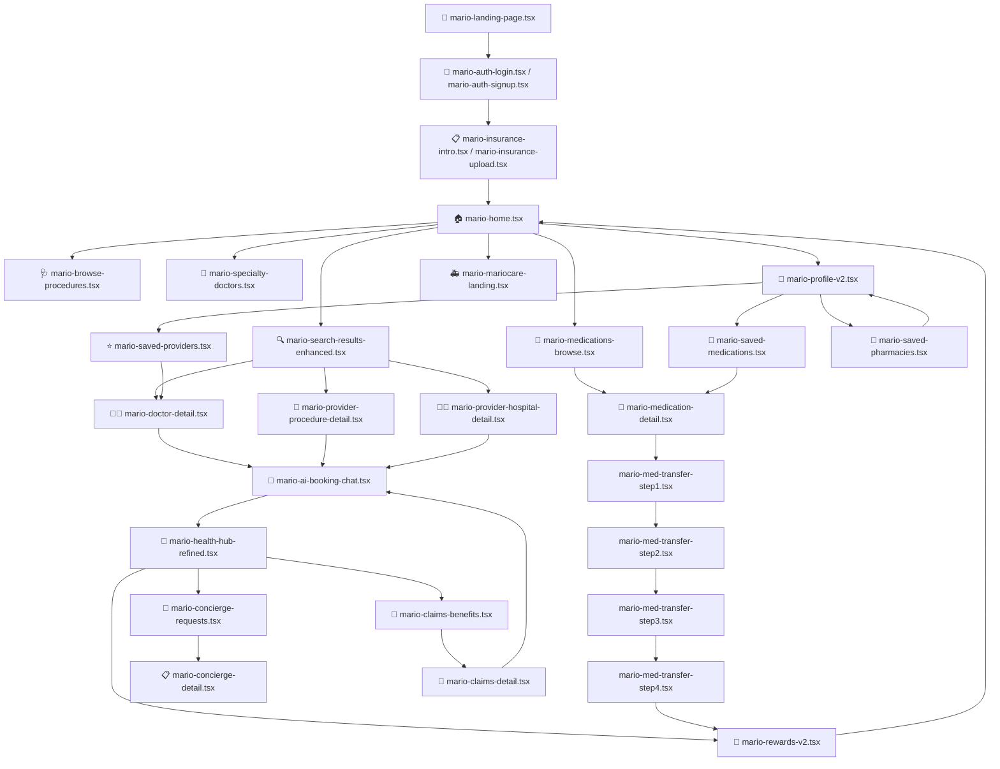

# FRONTEND_FLOW_MAP.md  

**Version:** 1.1  

**Last Updated:** 2025-11-10  

**Author:** AZ  

---

### 🧾 Appendix Notes

* File names and route labels match the page map above.

* Planned pages are clearly marked.

* Used for both design reference and dev onboarding.

