# FRONTEND_FLOW_MAP.md  

**Version:** 1.1  

**Last Updated:** 2025-11-10  

**Author:** AZ  

```mermaid

flowchart TD

    A[🏁 mario-landing-page.tsx] --> B[🔐 mario-auth-login.tsx / mario-auth-signup.tsx]

    B --> C[📋 mario-insurance-intro.tsx / mario-insurance-upload.tsx]

    C --> D[🏠 mario-home.tsx]

    D --> J[🩺 mario-browse-procedures.tsx]

    D --> K[🏥 mario-specialty-doctors.tsx]

    D --> L[💊 mario-medications-browse.tsx]

    D --> E[🔍 mario-search-results-enhanced.tsx]

    E --> G[👩‍⚕️ mario-doctor-detail.tsx]

    E --> I[👨‍⚕️ mario-provider-hospital-detail.tsx]

    E --> H[💉 mario-provider-procedure-detail.tsx]

    L --> M[💊 mario-medication-detail.tsx]

    G --> N[🤖 mario-ai-booking-chat.tsx]

    H --> N

    I --> N

    N --> O[🏥 mario-health-hub-refined.tsx]

    O --> P[🎁 mario-rewards-v2.tsx]

    P --> D

    M --> Q[mario-med-transfer-step1.tsx]

    Q --> R[mario-med-transfer-step2.tsx]

    R --> S[mario-med-transfer-step3.tsx]

    S --> T[mario-med-transfer-step4.tsx]

    T --> P

    O --> U[📅 mario-concierge-requests.tsx]

    U --> V[📋 mario-concierge-detail.tsx]

    O --> W[📄 mario-claims-benefits.tsx]

    W --> X[🧾 mario-claims-detail.tsx]

    X --> N

    D --> Y[👤 mario-profile-v2.tsx]

    Y --> Z[⭐ mario-saved-providers.tsx]

    Z --> G

    Y --> AA[💊 mario-saved-medications.tsx]

    AA --> M

    Y --> AB[🏪 mario-saved-pharmacies.tsx]

    AB --> Y

    D --> AC[🚑 mario-mariocare-landing.tsx]

```

---

### 🧾 Appendix Notes

* File names and route labels match the page map above.

* Planned pages are clearly marked.

* Used for both design reference and dev onboarding.

---

## Mock Data Archive Index

The following directories contain archived mock data used for fallback and development purposes:

- `/mock/archive/home-search-v1/` - Home search and procedure listing mock data
- `/mock/archive/health-rewards-v1/` - Health Hub and Rewards mock data
- `/mock/archive/ai-v1/` - MarioAI conversation scripts and chat mock data

**Note:** `/browse-procedures` remains a dedicated discovery route and is not affected by the unified `/home` flow.

